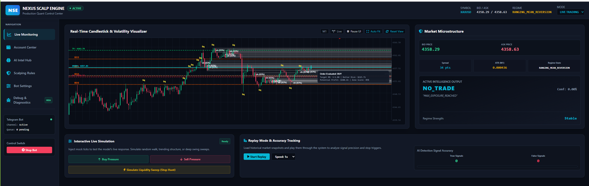
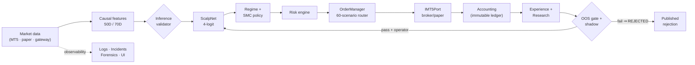
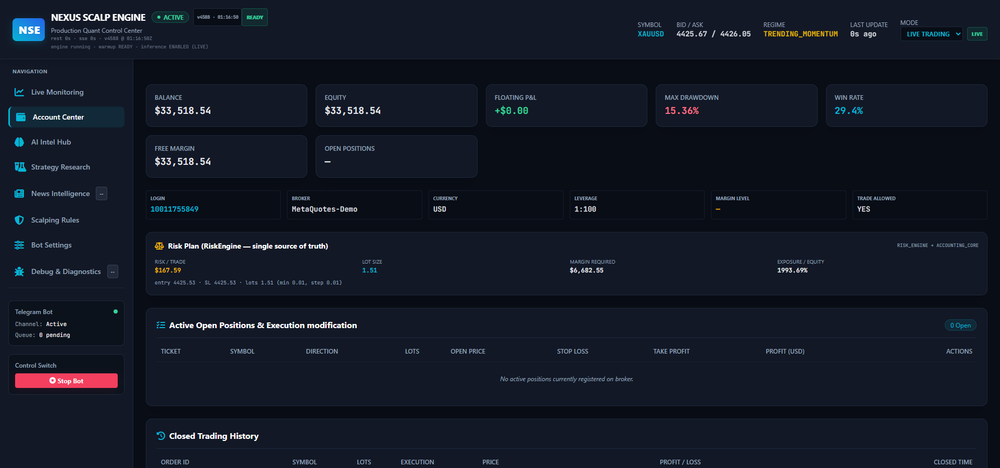
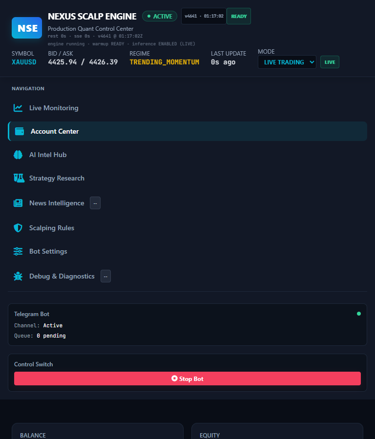
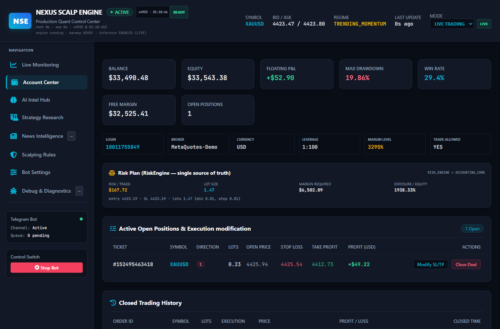

<div align="center">

# ⚡ Nexus Scalp Engine

**A research-driven quantitative trading platform — connecting market data, causal
feature engineering, deep-learning inference, policy, risk, execution, replay,
observability and reproducible validation into one auditable pipeline.**

*Hexagonal · Event-driven · MetaTrader 5 · XAUUSD M1 · Python 3.11*

</div>

<p align="center">
  
</p>

<div align="center">

[](https://github.com/Opselon/NexusTradingForexBot/releases/latest)
[](https://github.com/Opselon/NexusTradingForexBot/actions/workflows/ci.yml)
[](https://github.com/Opselon/NexusTradingForexBot/blob/main/tests/critical_suite.txt)
[](https://opselon.github.io/NexusTradingForexBot/)
[](https://www.python.org/)
[](https://pytorch.org/)
[](https://github.com/Opselon/NexusTradingForexBot#-installation--quickstart)
[](#-license--disclaimer)
[](docs/project/status.md)

</div>

---

## 🧭 What is this?

**Nexus Scalp Engine (NSE)** is a production-hardened, event-driven scalping
runtime *and* the research platform around it. It unifies:

- a **causal feature engine** (50D live contract; 70D research contract with
  news + liquidity intelligence),
- **ScalpNet** — a dual-path TCN + self-attention model with artifact-first
  governance (versioned datasets/experiments/models; inference needs no DB),
- an **SMC policy matrix** (Order Blocks, Fair Value Gaps, liquidity sweeps)
  behind an invariant risk engine and a 60-scenario execution router,
- **deterministic research tooling** — friction-aware backtests, purged
  walk-forward, a hard out-of-sample gate, bit-exact replay, counterfactual
  decision walks,
- **forensic observability** — structured logs, incident correlation, a
  forensic health engine and a pre-release deploy gate.

> **The differentiator is honesty.** Metrics without evidence render `n/a` —
> never fake zeros. OOS failure ⇒ candidate REJECTED (the repository publishes
> its own rejections). Promotion is operator-gated; nothing auto-promotes.
> [Project status →](docs/project/status.md) · [Capability matrix →](docs/project/capabilities.md)

## 🧠 Why Nexus?

Nexus exists against the two classic failures of trading systems:

| Failure mode | NSE's countermeasure |
| :--- | :--- |
| **Leaking the future** (lookahead in features/labels) | purged + embargoed walk-forward, strictly causal features, replay must be **bit-exact** vs dataset (INV-008) |
| **Hiding the truth** (fabricated metrics, silent failures) | evidence-graded claims, immutable ledgers, `n/a` over fake zeros, public [bug ledger](agents/bugs.md), deploy gate before any release |

Layered on top: hexagonal ports-and-adapters (`IMT5Port`), zero sync I/O on the
tick path, zero order authority for research/shadow/news, and runtime truth over
stale intent. Full philosophy: [docs/project/vision.md](docs/project/vision.md).

## 🚀 Start here

| Question | Answer |
| :--- | :--- |
| **What is Nexus?** | [Vision](docs/project/vision.md) · [Project story](docs/project/milestones.md) |
| **How do I run it?** | [Quickstart](#-installation--quickstart) · [First-run safety](docs/getting-started/first-run.md) |
| **How does it work?** | [Architecture](docs/architecture/overview.md) · [Data flow: tick → decision](docs/architecture/data-flow.md) |
| **How is it validated?** | [Research methodology](docs/research/methodology.md) · [OOS gate](docs/research/out-of-sample.md) |
| **What is real vs experimental?** | [Project status](docs/project/status.md) · [Capability matrix](docs/project/capabilities.md) |
| **Where is it going?** | [Roadmap](docs/project/roadmap.md) |
| **How do I contribute?** | [Contribution guide](docs/contributing/contribution-guide.md) |
| **What do the terms mean?** | [Glossary](docs/reference/glossary.md) · [FAQ](docs/reference/faq.md) |

### 🌍 Documentation in your language

| 🇬🇧 English | 🇮🇷 فارسی | 🇪🇸 Español | 🇸🇦 العربية | 🇩🇪 Deutsch |
| :---: | :---: | :---: | :---: | :---: |
| **[full](docs/index.md)** | [پیش‌نمایش](docs/fa/index.md) | [vista previa](docs/es/index.md) | [نظرة عامة](docs/ar/index.md) | [Übersicht](docs/de/index.md) |

Full site: **https://opselon.github.io/NexusTradingForexBot/** — translation
coverage is audited (`scripts/docs/check_translations.py`), not asserted.

## 🗺️ System at a glance

```text
Market data (MT5 Win32 IPC · ZMQ gateway · paper)
        │
        ▼
Causal features ── 50D scalp_v1 (live contract) ── 70D scalp_v3 (research)
        │
        ▼
Inference validator ──► ScalpNet (TCN + self-attention, 4-logit)
        │
        ▼
Regime classifier ──► SMC policy matrix ──► Risk engine (Kelly sizing, clamps)
        │
        ▼
OrderManager (60-scenario router · 11 position states · HARD_MAX_LOTS=10)
        │
        ▼
IMT5Port adapter ──► broker / paper          (order authority ENDS here)
        │
        ├──► Accounting ledger (SQLite WAL, immutable)
        ├──► Experience / autopsy intelligence
        ├──► Research: backtest → walk-forward → OOS gate → shadow → (operator) promotion
        └──► Observability: logs · incidents · forensics · Control Center UI
```



## 📊 Core capabilities

Legend: ✅ Certified · 🟢 Implemented · 🟡 Experimental · 🔵 Research · 📌 Planned

| Capability | Status | Evidence |
| :--- | :---: | :--- |
| 50D causal feature engine (`scalp_v1`, live contract) | ✅ | schema registry + golden/parity tests |
| Risk engine — Kelly sizing, margin clamps, `HARD_MAX_LOTS=10` | ✅ | clamp + execution suites |
| Shadow runtime — live feed, **zero order authority** | ✅ | `simulated=True` contracts, 60+ tests |
| Release pipeline — SHA-256, manifests, SBOM, post-publish verify | ✅ | `release.yml` + verify suites |
| Installer / update / rollback (per-user, no admin) | ✅ | stage-protocol tests + release artifacts |
| Provider health gate (LLM/AI services, bounded) | ✅ | live smoke evidence, CHG-0034/0039 |
| ScalpNet + artifact-first Model Factory | 🟢 | `model_generation/`, manifests, 10-gate load gate |
| Execution — 60-scenario router, 11 position states, circuit breaker | 🟢 | golden-tested seams, CLI E2E |
| Accounting ledger + experience/autopsy intelligence | 🟢 | immutable WAL ledger, behavior detectors |
| Research — backtests, purged walk-forward, hard OOS gate | 🟢 | BUG-183 regression suite, OOS floors |
| Replay (bit-exact) + streaming replay + forward tests | 🟢 | parity + anti-leakage suites |
| Governance — 14-gate verification, promotion transaction, rollback | 🟢 | `governance/`, MODEL_GOVERNANCE v2 |
| Incident response + forensic health + deploy gate | 🟢 | `incidents/`, `forensics/`, beforePush wiring |
| Control Center UI (FastAPI + SSE/WS, buildless SPA) | 🟢 | `Web/`, 249 API paths, debug console |
| 70D news+liquidity contract (`scalp_v3`) | 🟡 | candidate-only; **negative OOS evidence so far** |
| News intelligence (RSS/Atom, bounded gate) | 🟡 | opt-in; boost ≤ 0.05 / penalty ≤ 0.10; can never force a trade |
| Temporal liquidity features (22D) · MSLIE market structure | 🔵 | research candidates, never auto-promoted |
| Multi-broker beyond MT5 | 📌 | `IMT5Port` is the seam; no second adapter |

Full matrix with documentation links: [docs/project/capabilities.md](docs/project/capabilities.md).

## 🔬 Research pipeline

```text
DATA ──► FEATURES ──► LABELING ──► TRAINING ──► BACKTEST ──► WALK-FORWARD
                                                                  │
PROMOTION ◄─ SHADOW ◄─ REGISTRY ◄─ COUNTERFACTUAL ◄─ ROBUSTNESS ◄─ OOS GATE
(operator-gated; OOS failure ⇒ REJECTED)
```

Highlights: deterministic friction-aware backtests · purged+embargoed
walk-forward (defaults wired and recorded per run — BUG-183) · hard OOS floors
(macro-F1 ≥ 0.34, ECE ≤ 0.15, min evidence 100 rows) · bit-exact replay ·
frozen-capture forward tests · NO_TRADE counterfactual walks (2095 decisions,
first evidence: the confidence gate filtered trades that would have averaged
−0.506 R). See [research docs](docs/research/methodology.md).

## 🛡️ Validation philosophy

1. **Provenance or it didn't happen** — every artifact carries dataset ID,
   schema hash, git commit; `NOT_RECORDED` beats invention.
2. **Replay parity** — live = replay = training semantics, proven bit-exact.
3. **Rejections are results** — the 70D candidate's OOS rejection is public;
   a gate that rejects nothing is decoration.
4. **Dimension ≠ semantics** — models are validated on meaning, not shape
   (the CHG-0042 confidence-semantics repair is the canonical example).
5. **Deploy gate before release** — `nexus forensic --deploy-gate` wired into
   the push gate; CRITICAL ⇒ BLOCK.

## 📈 Project maturity

| Era | What it delivered |
| :--- | :--- |
| **Implemented & hardened** | engine core, risk/execution, ledger, UI, installer/release, observability |
| **Certified (forensic acceptance)** | 50D contract, OOS gate behavior, provider gate, release verification |
| **Experimental** | 70D series, news gate, temporal features, MSLIE |
| **Research** | counterfactual policy evidence, regime-conditional selection |
| **Planned** | multi-broker, translation coverage expansion, observability gap burn-down |

Explicitly **not** claimed: profitability guarantees, "production-ready"
trading performance, zero bugs. See [status](docs/project/status.md).

## 🗺️ Roadmap (evidence-based)

| Horizon | Streams | Headline items |
| :--- | :--- | :--- |
| **NOW** | VALIDATION · RESEARCH · RUNTIME | rebuild 70D candidate evidence (CHG-0042 semantics); counterfactual deepening; record-builder contract hardening ✅ |
| **NEXT** | ML · POLICY · DOCS | operator-gated 70D promotion decision (or documented retirement); counterfactual-driven policy review; translation coverage 100% |
| **LATER** | ML · ENGINE | temporal features promotion candidate; MSLIE → policy integration; regime-conditional selection |
| **LONG TERM** | EXECUTION · INFRA | broker abstraction beyond MT5; optional PostgreSQL profile; selective open-core |

Every item has an objective, dependencies and a completion gate:
[docs/project/roadmap.md](docs/project/roadmap.md).

## 📦 Installation & Quickstart

**End users (no Python):** download
`NexusScalpEngine-9.0.6-win-x64-setup.exe` (or portable `.zip`) from the
[latest release](https://github.com/Opselon/NexusTradingForexBot/releases/latest) —
the installer bundles the full runtime and ships with SHA-256 digests, a
release manifest and an SBOM. First run opens the setup wizard
(**default: PAPER**, never silently LIVE).

**One-line bootstrap (PowerShell, no Python/Git/admin):**

```powershell
iex (irm https://raw.githubusercontent.com/Opselon/NexusTradingForexBot/main/installer/install.ps1)
```

**Developers (source):**

```bash
git clone https://github.com/Opselon/NexusTradingForexBot.git
cd NexusTradingForexBot
python -m venv .venv && .\.venv\Scripts\Activate.ps1   # or source .venv/bin/activate
pip install -e .[dev]
pytest tests/unit -q          # smoke-test the toolchain — no broker needed
```

**Run:**

```text
nexus doctor                  # read-only diagnostics (19 categories) + suggested fixes
nexus start                   # PAPER mode (default) — Control Center at http://127.0.0.1:8080
nexus start --mode shadow     # live market feed, ZERO order authority
nexus start --mode live       # REAL execution — explicit interactive confirmation required
nexus stop                    # or Ctrl+C in the foreground
```

**Docker:** `docker compose up -d --build` → PAPER mode, dashboard at
`http://localhost:9090`, readiness at `/health`. Reference: [docs/docker.md](docs/docker.md).

> 💡 The safest first-run path is **Demo MT5 account → SHADOW → small LIVE** —
> the full ladder: [docs/getting-started/first-run.md](docs/getting-started/first-run.md)

### CLI (the operational surface)

```text
nexus help · version · doctor · status · health · config
nexus start | stop | restart          # paper default; live needs confirmation
nexus logs [--tail N] [--errors]      # severity-split structured logs
nexus test --mode quick|unit|integration
nexus update check|latest|download|install|verify|status|history|rollback|doctor
nexus db hygiene status|plan|run      # AUDIT_ONLY by default
nexus incidents · nexus forensic --deploy-gate · nexus export-diagnostics
```

Exit codes are a stable contract (`0/1/2/3/4/5`). Full reference:
[docs/reference/cli-reference.md](docs/reference/cli-reference.md) ·
[CLI guide](docs/guides/cli.md).

## 🏗️ Architecture

**Hexagonal (ports-and-adapters), event-driven.** Broker platforms, models and
network adapters are isolated behind port contracts; the tick hot path never
blocks on DB/analytics/training; research/learning components hold zero order
authority.

Deep dives: [Architecture overview](docs/architecture/overview.md) ·
[System map](docs/architecture/system-map.md) ·
[Data flow](docs/architecture/data-flow.md) · [Runtime](docs/architecture/runtime.md) ·
[Model pipeline](docs/architecture/model-pipeline.md) ·
[Execution pipeline](docs/architecture/execution-pipeline.md) ·
[Observability](docs/architecture/observability.md) ·
[Database](docs/architecture/database.md).
The authoritative internal map lives in [`agents/skill.md`](agents/skill.md).

```text
src/nexus_scalp/   Core engine (domain · ports · adapters · features · models ·
                   training · signals · strategies · risk · execution · accounting ·
                   application · research · model_generation · governance · shadow ·
                   news · incidents · forensics · hygiene · observability · web · release)
Web/               Control Center UI — buildless vanilla-JS SPA (no Node runtime)
tests/             Unit (~1931) · integration · golden · CLI E2E (66) · js · installer
docs/              Engineering documentation (this IA tree) + forensic report archive
agents/            Engineering memory: skill map · bug ledger · invariants · contracts
scripts/           Build/release/CI tooling + docs validation
installer/         PowerShell bootstrap installer (stage protocol)
configs/           base.yaml · live.yaml.example        pics/  Screenshots
docker/            entrypoint · healthcheck             site/  GitHub Pages source
```

## 🧪 Development

```bash
./beforePush.sh                 # or .\beforePush.ps1 — the 5-stage quality gate:
                                # ruff lint · format · mypy src · critical pytest suite
                                # (~779 tests, RAM-aware xdist) · forensic deploy gate
pytest tests/unit -q            # full unit corpus (~1931 tests)
```

Contributors: read the [contribution guide](docs/contributing/contribution-guide.md)
and the [multi-agent contract](agents/multi-agent-git-contract.md) — this repo is
intentionally developed as *codebase + engineering memory* (taskboard, bug
ledger, invariants, decision records). Documentation work has its own workflow:
[docs/contributing/documentation.md](docs/contributing/documentation.md).

## 📸 The Control Center

`nexus start` serves a live dashboard: M1 chart with order-block / FVG /
swept-liquidity overlays and entry-SL-TP lines with risk tooltips; tabs for
Overview · Strategy Research · News Intelligence · Scalping Rules · Account
Performance & Intelligence · Debug Hub; live algorithm tuner (no restart).

<p align="center">
  
  
  
  
</p>

## 📚 Documentation map

| Section | Contents |
| :--- | :--- |
| [Getting started](docs/getting-started/installation.md) | installation · quickstart · first-run safety · configuration |
| [Project](docs/project/vision.md) | vision · scope · **status** · **capability matrix** · **roadmap** · milestones |
| [Architecture](docs/architecture/overview.md) | overview · system map · runtime · research stack · data flow · model/execution pipelines · observability · database |
| [Research](docs/research/methodology.md) | methodology · datasets · backtesting · walk-forward · OOS · replay · counterfactuals · validation · reproducibility |
| [Engineering](docs/engineering/quality.md) | quality & testing · CI · release process · security |
| [Guides](docs/guides/cli.md) | CLI · troubleshooting · common workflows |
| [Contributing](docs/contributing/contribution-guide.md) | guide · docs workflow · adding a language |
| [Reference](docs/reference/glossary.md) | CLI reference · glossary · terminology · FAQ |

Internal engineering artifacts are preserved as-is: [`agents/skill.md`](agents/skill.md)
(authoritative map) · [`agents/bugs.md`](agents/bugs.md) (forensic bug ledger) ·
[`agents/runtime_invariants.md`](agents/runtime_invariants.md) ·
[`docs/70D_DATA_CONTRACT.md`](docs/70D_DATA_CONTRACT.md) · [`docs/RELEASE.md`](docs/RELEASE.md).

## 🔐 Safety & Disclaimer

- `nexus start` **never** defaults to LIVE; LIVE prints the full risk panel and
  requires interactive confirmation.
- Account-identity fail-safe: live connect refuses a terminal logged into a
  different account than configured (BUG-142).
- Shadow/simulated runs carry **zero order authority**; research/news workers
  can never place orders.
- Hard clamps: margin ≤ 20% free, single-position exposure cap,
  `HARD_MAX_LOTS = 10.0`, circuit breaker → SAFE_MODE, kill switch via
  dashboard/CLI.

> 🚨 **This bot places REAL trades with REAL money in LIVE mode.** Algorithmic
> trading — especially leveraged XAUUSD/Gold scalping — carries extreme
> financial risk. This software is provided strictly for educational, academic
> research and simulation purposes. Nothing in this repository is investment
> advice, and no performance or profitability is promised or implied. Verify
> every setting twice, start on a demo account, and keep the engine supervised.

**License:** Proprietary — All Rights Reserved.

---

<div align="center">

📚 [Documentation](https://opselon.github.io/NexusTradingForexBot/) ·
🗺️ [Roadmap](docs/project/roadmap.md) ·
🏗️ [Architecture](docs/architecture/overview.md) ·
⚡ [Quickstart](#-installation--quickstart) ·
🤝 [Contributing](docs/contributing/contribution-guide.md) ·
🐛 [Issues](https://github.com/Opselon/NexusTradingForexBot/issues) ·
📦 [Releases](https://github.com/Opselon/NexusTradingForexBot/releases)

**Nexus Scalp Engine** — *evidence over assumptions.*

</div>
